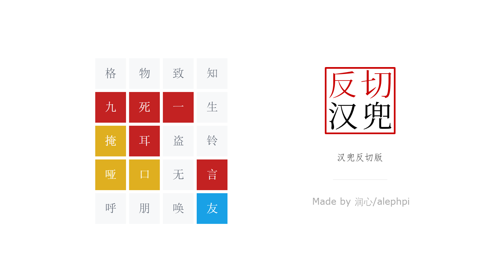

# 反兜（反切汉兜、汉兜反切版、Fandle） 

A Chinese Hanzi variation of [Wordle](https://www.powerlanguage.co.uk/wordle/). 汉字 Wordle.

[fandle.netlify.app](https://fandle.netlify.app)

请勿泄题！PLEASE DO NOT SPOIL

## Development Setup

- Insall [Node.js](https://nodejs.org/en/) >=v16 and [pnpm](https://pnpm.io/)
- Run `pnpm install`
- Run `pnpm dev` and visit `http://localhost:4444`

## 成语勘误
详见 https://github.com/alephpi/idiom-dictionary
## Tech Stack

- [Vue 3](https://v3.vuejs.org/)
- [Vite](https://vitejs.dev/)
- [VueUse](https://vueuse.org/)
- [UnoCSS](https://github.com/antfu/unocss)
- [Vitesse Lite](https://github.com/antfu/vitesse-lite)

## License

[MIT](./LICENSE) License © 2022-PRESENT [润心/alephpi](https://github.com/alephpi)

## 特别致谢
汉兜原作者 antfu & Inès。反兜只是我初学vue的练手项目，主要依照汉兜模板改的。感激之情难以言表。

## 关于拼音的几点说明

1. j,q,x,y 后的 u 均还原为 v。例如均、群、熏、云同韵母但不与蹲、吞、轮同韵母
2. b,p,m,f 后的 o 均还原为 uo。例如波、泼、摸、佛与火、罗同韵母。
3. y,w的处理：
   1. 字面模式下，y,w 视为声母，韵母按字面形式认定。例如恩（en）与温（wen）同韵母，单（dan）与玩（wan）同韵母，幽（you）与九（jiu）不同韵母。
   2. 严格模式下，y,w 不视为声母，以其开头的拼音为零声母，韵母还原。例如温（uen）与蹲（duen）同韵母，邀（iao）与交（jiao）同韵母。零声母拼音相互视为同声母。

4. 知吃诗日资瓷思衣的韵母暂且按同韵母处理。（未来视情况修改）
5. 以上规则请参照汉语拼音方案附则(1)(4)(5)款。